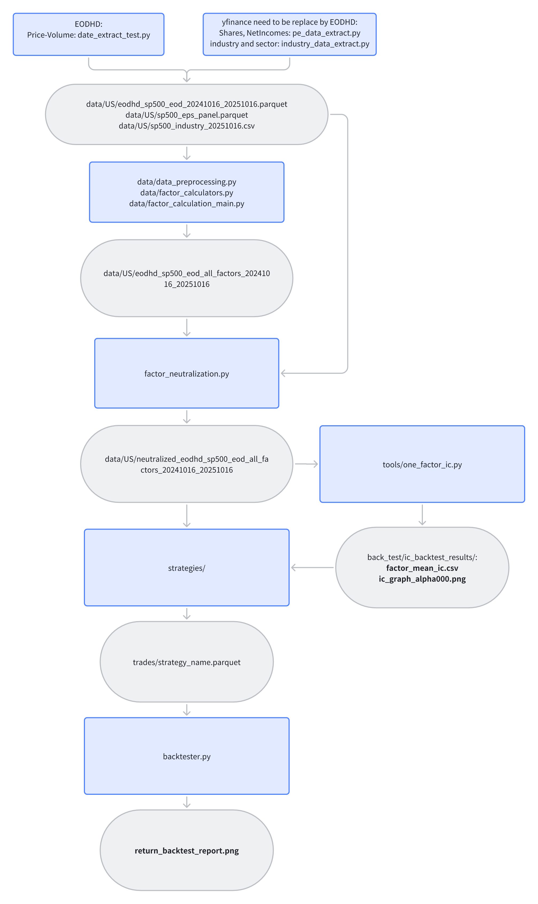
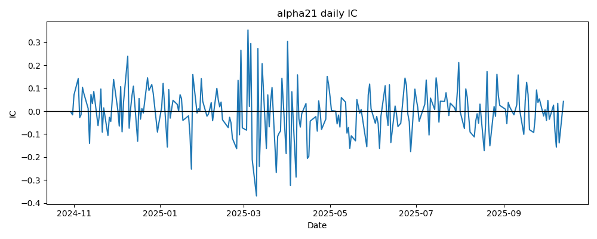

# Alpha191 Project

Author: Trove Quant 
Date: Sep 2025

---
## Process Overview


## Sample Output
one factor IC



All Factors IC:
<br>back_test/ic_backtest_results/factor_mean_ic.csv


Backtester Output:


<details>
<summary><h2>data</h2></summary>

### data
prive-volume
<br> Equitiy Info (Section, Industry)
<br>Market Caps, Earnings, Outstanding shares...

### scripts
***data extraction
, preprocessing
, factor calculation and neutralization***
#### factor_calculation_main.py
End-to-end runner for the factor pipeline.  
Inputs: files under `data/sliced/`  
Outputs: factor panels

#### factor_calculators.py
Library of factor functions (e.g., momentum, quality, value, volatility).  
Reusable APIs called by `factor_calculation_main.py`.

</details>

<details>
<summary><h2>Core Scripts</h2></summary>

### tools/one_factor_ic.py
Computes and graph Information Coefficient for a single factor

### strategies
input: Data
<br>Output: All the trades:
['symbol', 'entry_ts', 'exit_ts', 'entry_price', 'exit_price', 'volume',
       'type', 'exit_type', 'pnl', 'pnl_cost']

### Backtester.py
input: trades
<br>output: Cumlative returns and Max Drawdown Graph, All the Performance Statistics

</details>

<details>
<summary><h2>Getting Started</h2></summary>

### 1) Environment (unfinished)
- Python ≥ 3.10  
- Suggested packages: `pandas`, `numpy`, `scipy`, `pyarrow` or `fastparquet`, `matplotlib`, `seaborn` (optional)

```bash
python -m venv .venv
source .venv/bin/activate   # Windows: .venv\Scripts\activate
pip install -r requirements.txt
